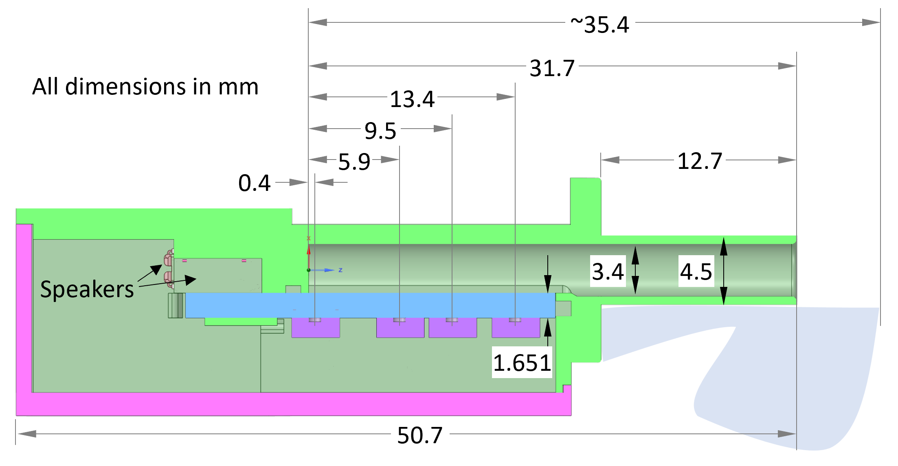

# Auren Data

## Introduction

This repository collect data associated with the Auren hearing probe. The Auren probe interfaces with the Tympan, enabling a wide variety of hearing tests, such as wideband audiometric immitance (WAI) and distortion product otoacoustic emissions (DPOAEs).

This repository contains information about:
* The Auren electrical design
* The Auren mechanical design
* Sample raw calibration data (wav files)
* Sample calibrations (json files)

## Getting Started

To get started with the Auren, start by following the [Getting Started with Tympan Wiki](https://github.com/Tympan/Docs/wiki/Getting-Started-with-Tympan).

The firmware source code for controlling the Auren is located in the [Tympan_Sandbox](https://github.com/Tympan/Tympan_Sandbox/tree/master/OpenHearing/DigMicProbeTest), with a [Precompiled Hex File Here](https://github.com/Tympan/Tympan_Sandbox/tree/master/OpenHearing/_Precompiled). Eventually, this firmware will be moved to this repository.

Once the Auren firmware is running on the Tympan, you can control the hardware through any appropriate serial interface. This includes the Arduino Serial Monitor, or Python!

For an example using the Tympan to calibration the Auren through Python, see the [Auren-Python Calibration Notebook](https://github.com/Tympan/auren-python/blob/main/jupyter_notebooks/Calibration.ipynb).

More details to follow. Feel free to post questions in the Github issues page.

